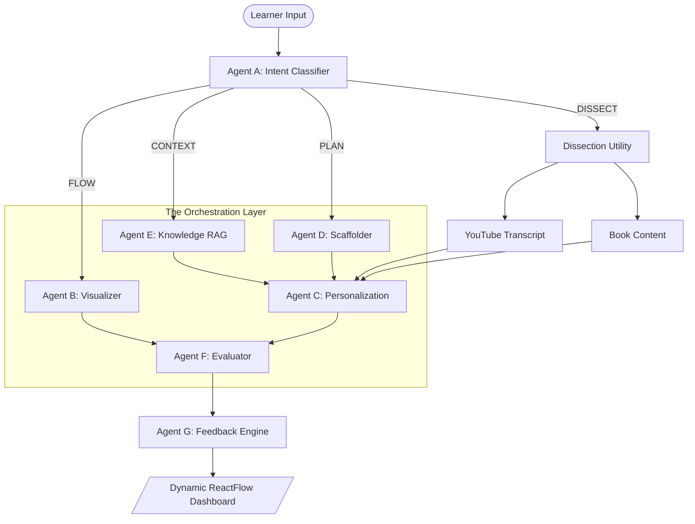

# Versa Arch AI - The Real-Time System Teacher 🧠✨

> **Built for the Gemini 3 Global Hackathon: Transitioning from Static Chat to Autonomous Agentic Orchestration.**

**VersaArch AI** is a multi-agent reasoning engine designed to decompose, visualize, and teach complex systems at the speed of thought. By leveraging **Gemini 2.0 Flash Thinking**, we've built more than a chatbot; we've built a **Real-Time Teacher** that senses user intent, dissects external sources (Videos/Books), and orchestrates a network of 7 autonomous agents to create a high-fidelity, adaptive learning environment.

---

## 🏛️ System Architecture

VersaArch AI operates on a **Multimodal Agentic Loop** powered by LangGraph. It is designed to model "Cause and Effect" in complex architectures rather than just retrieving text.

---

## 🚀 Strategic Features (Action Era Ready)

### 1. **Autonomous Dissection Engine** (Multimodal Reasoning)
*   **Video Dissection**: Paste a YouTube link. The system extracts transcripts and senses the temporal flow of information to generate a logic-accurate system diagram.
*   **Book Dissection**: Deep-dives into specific literature, extracting "First Principles" rather than generic summaries.
*   **Contextual Priority**: Uses Gemini 3's high-context window to prioritize provided source material over generic knowledge bases.

### 2. **7-Agent Orchestrator** (Beyond Prompt Wrappers)
Our architecture utilizes specialized agents for complex reasoning tasks:
*   **Agent A (Intent)**: Senses learner needs (Visualize vs. Evaluate).
*   **Agent B (Visualizer)**: Generates valid React Flow JSON for architectural mapping.
*   **Agent C (Personalization)**: Adjusts analogies based on "Vibes" (e.g., Explain tech via "Lord of the Rings").
*   **Agent D (Scaffolder)**: Builds prerequisite trees to bridge knowledge gaps.

### 3. **The Real-Time Teacher Flow**
*   **Interactive System Diagrams**: Dynamic, draggable visualizations of concepts (Kubernetes, Rust Lifetimes, GCP VPCs).
*   **Micro-Quizzes & Eval Loop**: Agent F constantly tests your competency, self-correcting the learning path based on your scenario-based answers.

---

## 🛠️ Tech Stack & Integration

| Component | Technology | Role |
| :--- | :--- | :--- |
| **LLM Backend** | Gemini 2.0 Flash Thinking | Multimodal reasoning & "Thinking" signatures |
| **Orchestration** | LangGraph.js | Stateful, multi-actor agent management |
| **Frontend** | Next.js 14 (App Router) | SSR Stability & specialized routing hooks |
| **Visuals** | React Flow | Interactive architecture graphing |
| **Styling** | Tailwind CSS + Framer Motion | Premium glassmorphic "Vibe Engineering" |
| **State** | Zustand | Real-time UI theme and state synchronization |

---

## ❓ FAQ & Troubleshooting (VersaArchAI)

### **General Questions**
**Q: How is this different from a normal RAG chatbot?**
A: Most RAG bots just retrieve text. VersaArch AI **orchestrates agents** to redraw diagrams, build prerequisite trees, and create scenario-based quizing environments. It reasons over the *structure* of data, not just the keywords.

**Q: Can I use it for non-technical topics?**
A: While optimized for "Systems Thinking" (Coding, Cloud, Engineering), the engine can dissect any logical structure, including history timelines or biological processes.

### **Dissection Features**
**Q: Does it actually watch the video?**
A: In the current Beta, it utilizes Gemini 3's ability to reason over long-form transcripts and metadata to understand cause-and-effect within the video duration.

**Q: How do I trigger Book dissection?**
A: Simply type `Book: [Title] [Topic]` or `Analyze this book: [Title]`. The Intent Agent (Agent A) will automatically route to the Dissection Engine.

### **Common Issues**
**Q: My GUI isn't updating after a change?**
A: Because of our heavy use of Next.js 14 static optimization, a **Hard Refresh (Ctrl+F5)** is recommended to sync the browser with the latest agentic build.

---

## 📦 Quick Start

1.  **API Keys**: Add `GEMINI_API_KEY` to `.env.local`.
2.  **Install**: `npm install`
3.  **Launch**: `npm run dev`
4.  **Try this**: Paste `https://youtu.be/kOa_llowQ1E` into the playground.

---

> **Note**: This project is built as a submission for the Gemini 3 Global Hackathon. It focuses on the **Real-Time Teacher** and **Vibe Engineering** tracks by integrating autonomous testing loops and immersive UI.
